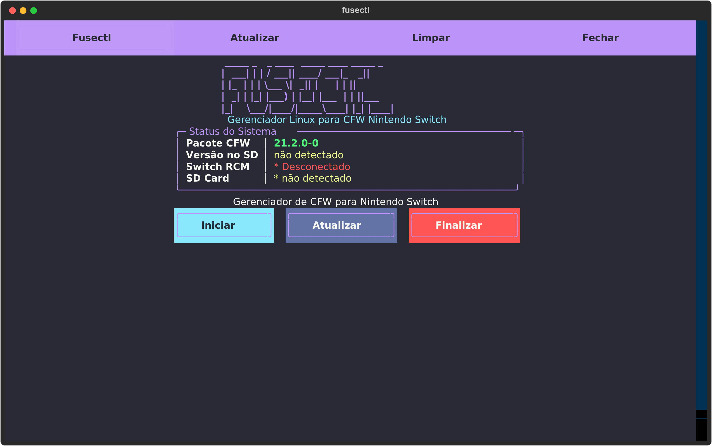

# fusectl

Gerenciador Linux para Custom Firmware Nintendo Switch (Tegra X1 - Erista).

Compatível com qualquer all-in-one pack de CFW (Atmosphere, Hekate, etc.).



## Funcionalidades

- Injeção de payload RCM via USB (CVE-2018-6242, Tegra X1 Erista)
- Instalação e atualização de pacotes CFW no microSD
- Cópia de firmware (.nca) para o SD
- Detecção automática de dispositivos, SD montado e versões
- Interface TUI com tema Dracula e navegação por abas
- CLI completa para automação e scripts

## Requisitos

- Python 3.10+
- libusb 1.0
- Linux com kernel 5.4+ (para exFAT nativo) ou fuse-exfat
- Conexão USB direta (sem hub) com porta USB 3.0

## Instalação

### Via script (recomendado)

```bash
git clone <repo-url> fusectl
cd fusectl
./install.sh
```

O script instala: libusb (se necessário), ambiente virtual Python, dependências e regra udev.

### Via .deb

Disponível na página de releases do GitHub.

```bash
sudo dpkg -i fusectl_*.deb
```

A regra udev é instalada em `/usr/share/fusectl/udev/`. Para ativá-la:

```bash
sudo cp /usr/share/fusectl/udev/50-switch-rcm.rules /etc/udev/rules.d/
sudo udevadm control --reload-rules
```

### Via AppImage

Disponível na página de releases do GitHub. Não requer instalação.

```bash
chmod +x fusectl-x86_64.AppImage
./fusectl-x86_64.AppImage
```

A regra udev precisa ser instalada manualmente (veja seção Solução de problemas).

### Via Flatpak

```bash
flatpak-builder --install --user build-dir packaging/flatpak/com.github.fusectl.fusectl.yml
```

O Flatpak roda em sandbox — a regra udev precisa ser instalada manualmente no host para acesso USB.

## Uso

### Interface TUI

```bash
./run.sh
```

Abre a interface com 5 abas: Home, RCM, Instalar, Atualizar, Firmware.

Atalhos:
- `1-5` troca de aba
- `r` atualiza status
- `q` ou `Ctrl+Q` sai
- `d` alterna tema claro/escuro

### Linha de comando

```bash
# Verificar se o Switch está em modo RCM
fusectl rcm status

# Injetar payload
fusectl rcm inject /caminho/para/payload.bin

# Listar payloads disponíveis no pacote
fusectl payloads -p /caminho/para/pacote-cfw

# Ver versões detectadas
fusectl version -p /caminho/para/pacote-cfw -s /mnt/sdcard

# Instalar CFW no SD
fusectl install /caminho/para/pacote-cfw /mnt/sdcard

# Atualizar CFW no SD
fusectl update /caminho/para/pacote-cfw /mnt/sdcard

# Forçar atualização (mesma versão)
fusectl update /caminho/para/pacote-cfw /mnt/sdcard --force

# Copiar firmware para SD
fusectl firmware /caminho/para/XX.Y.Z /mnt/sdcard

# Detectar SD de Switch montado
fusectl sd-detect
```

## Fluxo típico

1. Conectar Switch em modo RCM (Volume+ durante boot)
2. `./run.sh` (abre TUI)
3. TUI detecta Switch em RCM e SD montado
4. Selecionar payload e injetar (Switch inicializa Hekate)
5. No Hekate: UMS mode (monta SD via USB) ou inserir SD no PC
6. TUI detecta SD montado e exibe espaço livre
7. Selecionar: Instalar (primeira vez) ou Atualizar
8. Aguardar cópia

## Estrutura do projeto

```
fusectl/
  core/       # Configuração, logger, detecção de versão
  rcm/        # Detecção USB e injeção de payload
  sdcard/     # Detecção, instalação, atualização do SD
  firmware/   # Cópia de NCAs
  ui/         # Interface TUI (Textual)
tests/        # Testes automatizados (pytest)
udev/         # Regra para acesso USB sem root
scripts/      # Diagnóstico e hotplug
packaging/    # .deb, Flatpak, AppImage
```

## Pacotes CFW compatíveis

O fusectl detecta pacotes CFW por estrutura (presença de `atmosphere/`, `bootloader/`, etc.), não por formato proprietário. Funciona com qualquer all-in-one pack que siga a estrutura padrão do Atmosphere + Hekate.

Detecção de versão por fallback chain:
1. Arquivo de versão na raiz do pacote (`cnx.txt`, `version.txt`, `pack.txt`)
2. Tag de versão em `bootloader/hekate_ipl.ini` (formato `{TAG X.Y.Z}`)
3. Padrão de versão no nome do diretório (ex: `AIO-19.0.1-3`)

## Solução de problemas

### Pop!_OS / Ubuntu

- **udev**: regra `50-switch-rcm.rules` deve ter prioridade menor que `69-libmtp`. O `install.sh` cuida disso automaticamente.
- **plugdev**: grupo pode não existir por padrão. O `install.sh` cria e adiciona o usuário.
- **MTP**: ModemManager e gvfs-mtp competem pelo dispositivo. A regra udev inclui `ENV{ID_MM_DEVICE_IGNORE}="1"` e `ENV{MTP_NO_PROBE}="1"`.
- **autosuspend**: kernel pode suspender o dispositivo durante a transferência. A regra udev desabilita com `autosuspend_delay_ms=-1`.

### Geral

- **USB hub**: conexão direta USB-A para USB-C é obrigatória. O bootrom Tegra RCM não funciona via hub USB.
- **Porta USB 3.0**: porta xHCI (geralmente azul) é obrigatória. USB 2.0 pode dar timeout.
- **Device stale**: após tentativas falhadas, reconectar fisicamente o Switch.
- **exFAT**: kernel 5.4+ para suporte nativo, ou instalar fuse-exfat.
- **libusb**: deve ser versão 1.0 (não 0.1).
- **Permissão USB**: se `/dev/bus/usb/` não está acessível, verificar udev e grupo plugdev.

### Diagnóstico

```bash
# Diagnóstico completo do ambiente USB
bash scripts/diag_rcm.sh

# Injeção com debug completo
.venv/bin/python -m fusectl -v rcm inject <payload.bin>
```

## Aviso legal

Esta ferramenta é destinada exclusivamente ao uso pessoal e legítimo em hardware
de propriedade do usuário, para fins de interoperabilidade de software.

**O que este projeto faz:**

- Fornece uma interface para executar código em hardware que o usuário possui
- Utiliza a vulnerabilidade pública CVE-2018-6242 (Tegra X1 RCM), documentada
  e divulgada responsavelmente por Kate Temkin / ReSwitched em junho de 2018
- Permite ao usuário gerenciar software no microSD do seu próprio console

**O que este projeto NAO faz:**

- Não distribui software proprietário, firmware, jogos ou qualquer conteúdo
  protegido por copyright da Nintendo ou terceiros
- Não contorna sistemas de proteção em tempo de execução (não modifica o OS do
  console, não altera assinaturas, não bypassa verificação de jogos)
- Não facilita pirataria — não há funcionalidade para instalar, copiar ou
  executar software obtido ilegalmente
- Não coleta dados, não se comunica com servidores externos, não altera o
  comportamento online do console

**Base legal:**

- **DMCA sec. 1201(f)** — O direito de engenharia reversa para
  interoperabilidade é explicitamente protegido. O exploit RCM permite executar
  software legítimo em hardware próprio sem afetar direitos de terceiros.
- **Diretiva 2009/24/CE art. 6** (UE) — Descompilação e interoperabilidade
  são permitidas quando necessárias para obter informações que permitam a
  interoperabilidade de um programa criado independentemente.
- **CVE-2018-6242** — A vulnerabilidade é de conhecimento público, documentada
  no MITRE/NVD, e reside em hardware (bootrom), não podendo ser corrigida via
  atualização de software. A Nintendo reconheceu isso publicamente ao lançar a
  revisão Mariko (2019) com hardware corrigido.

**Isenção de responsabilidade:**

O uso desta ferramenta é de inteira responsabilidade do usuário. Os autores não
incentivam, apoiam ou facilitam pirataria de software, violação de termos de
serviço ou qualquer atividade ilegal. Este projeto não tem afiliação com a
Nintendo, Atmosphere, Hekate ou desenvolvedores de pacotes CFW.

## Créditos

Injeção RCM baseada no protocolo [fusee-launcher](https://github.com/Qyriad/fusee-launcher) (Kate Temkin / ReSwitched, CVE-2018-6242).

## Testes

```bash
source .venv/bin/activate
python -m pytest tests/ -v
```

## Desinstalação

```bash
./uninstall.sh
```

Remove ambiente virtual, regra udev e logs. Os arquivos do projeto permanecem.

## Licença

GPL-3.0-or-later. Consulte [LICENSE](LICENSE) para detalhes.
